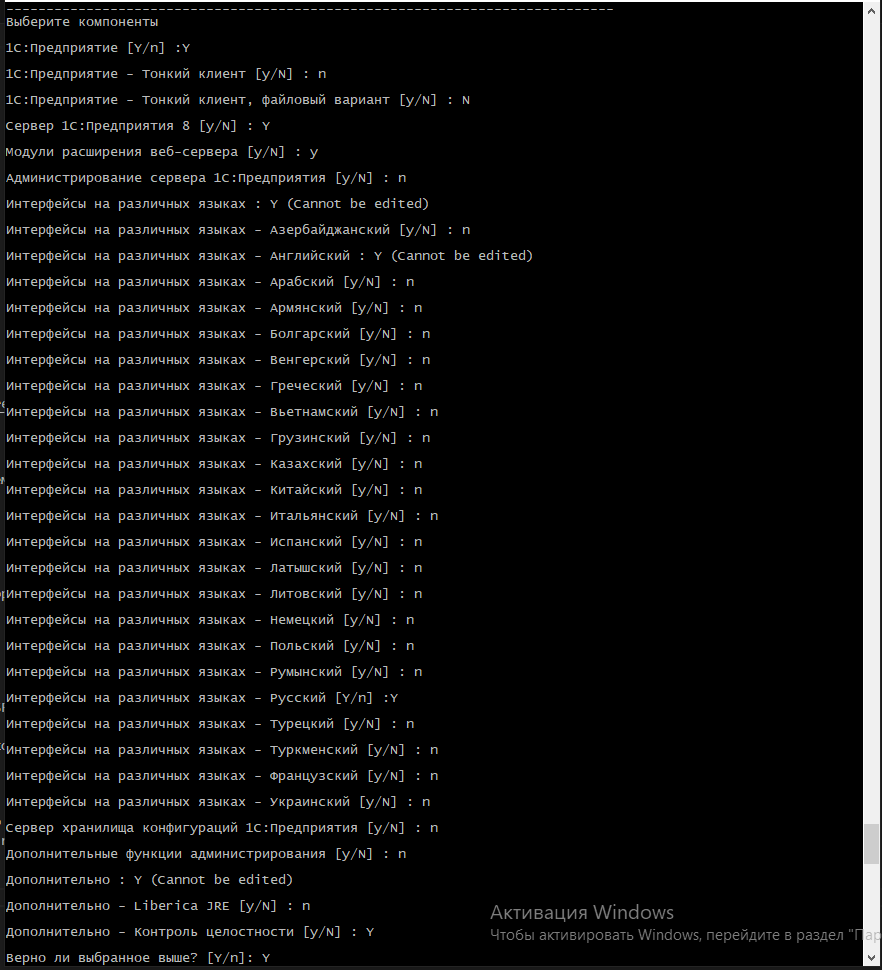
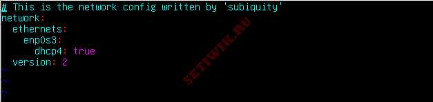

# 1C_serv_on_Ubuntu

Установка ОС  
Язык установки - русский  
При разметке диска необходимо отключить использование LVM  
Файловая система ext4  
Имя пользователя "sudoer"  
Включить установку OpenSSH сервера  
Настроить часовой пояс в соответствии с локацией  
На учетную запись "sudoer" должен быть установлен сложный пароль не менее 15 символов.  

После установки каждый администратор должен работать под своей учетной записью.  

Создание учетной записи:

adduser username  

и добавление в группу sudo:  

usermod -aG sudo  

adduser username  

usermod -aG sudo username
Настройка часового пояса:

1. Вывод доступных временных зон

2. Установка временной зоны

3. Проверка вывода установленной временной зоны/текущего времени

1  timedatectl list-timezones
2  timedatectl set-timezone Asia/Magadan
3  timedatectl

Устанавливаем Zabbix Agent:

1 wget https://repo.zabbix.com/zabbix/6.0/ubuntu/pool/main/z/zabbix-release/zabbix-release_6.0-4+ubuntu22.04_all.deb  

2 dpkg -i zabbix-release_6.0-4+ubuntu22.04_all.deb  

3 apt update

Установка Zabbix-Agent и включаем автостарт демона при загрузке системы:

1  apt install zabbix-agent

2  systemctl enable zabbix-agent

Затем скачиваем дистрибутив сервеной части 1С (Технологическая платформа)(*.tar.gz) (у официального поставщика ПО)

Устанавливаем пакеты необходимые для работы тонкого клиента:

1  apt install imagemagick unixodbc ttf-mscorefonts-installer

Затем Скачиваем программу WinCSP. Подключаемся к Linux-машине как к SFTP-серверу и закидываем в файлы серверной части 1C:

Чтобы распаковать tar.gz архив в текущую директорию нужно выполнить команду:

tar xvzf archive.tar.gz

Делаем файл исполняемым (вместо my_program указывайте название вашего приложения):
sudo chmod +x my_program.run (chmod +x setup-full-8.3.22.1750-x86_64.run)

И выполняем запуск данного приложения:
./setup-full-8.3.22.1750-x86_64.run

Проходим опросник установки компонентов:

Настройка автозапуска сервера 1С после перезагрузки:

1C c версии 8.3.21 стала использовать systemd-сценарий запуска кластера серверов и сервера администрирования и находится в папке с платформой:

/opt/1cv8/x86_64/8.3.22.1750/srv1cv8-8.3.22.1709@.service

Установить его можно командой:

systemctl link /opt/1cv8/x86_64/8.3.22.1750/srv1cv8-8.3.22.1750@.service

Запускаем сервер 1С

systemctl start srv1cv8-8.3.22.1750@default.service

Добавляем в автозапуск

systemctl enable srv1cv8-8.3.22.1750@default.service

Проверяем работу сервера 1С:

systemctl status srv1cv8-8.3.22.1750@default.service

Проверяем, слушают ли системные процессы tcp порты:

netstat -tulnp

Сервер 1С успешно установлен и запущен.

Настроим статический IP-адрес сервера:

Для этого откройте файл конфигурации subiquity-disable-cloudinit-networking.cfg в каталоге /etc/cloud/cloud.cfg.d/

$ sudo vim /etc/cloud/cloud.cfg.d/subiquity-disable-cloudinit-networking.cfg

Установите «network» в положение «disabled«.

network: {config: disabled}

Сохраните изменения и завершите работу. 

В моем случае у меня есть файл 00-installer-config.yaml

$ sudo vim /etc/netplan/00-installer-config.yaml

В файле конфигурации мы видим директиву «network«, которая содержит 2 элемента. Первый — это «ethernets«, который определяет сетевой интерфейс, а второй-версия средства визуализации, которое является «systemd-networkd«. Для экземпляров без графического интерфейса и NetworkManager для рабочего стола Ubuntu ( с графическим интерфейсом).

Файл конфигурации "network"
Файл конфигурации «network»
Нам требуется установить значение «dhcp4» на «no«, чтобы отключить протокол DHCP, и указать статический IP-адрес интерфейса следующим образом.